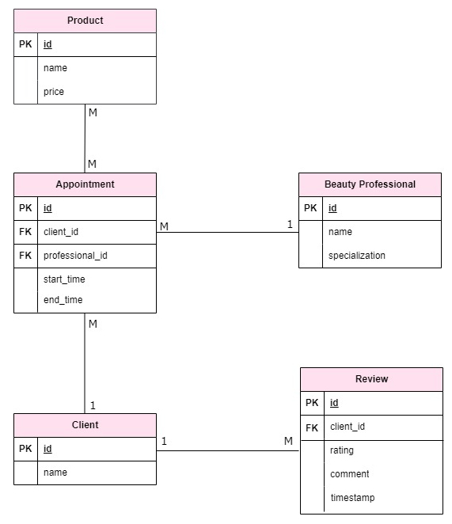
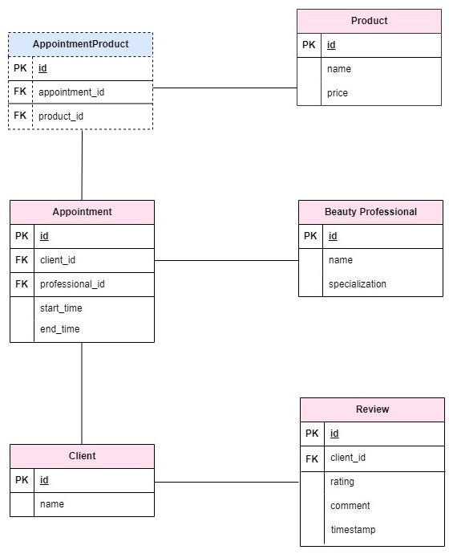

# Beauty Salon App in Spring Boot

## Business Requirements

1. Clients should be able to book appointments for various beauty services.
2. Beauty professionals (stylists, make-up artists) should be able to view their schedules.
3. The system should support inventory management for beauty products.
4. The system should allow clients to rate and review beauty services.
5. Beauty professionals should have profiles with their expertise and certifications.
6. The system should generate reports on customer feedback.
7. Maintain a client database with contact information, appointment history, and preferences.
8. Develop a marketing strategy to attract new clients and retain existing ones.
9. Provide ongoing training for staff to stay updated on the latest beauty trends, techniques, and products.
10. Ensure a clean, comfortable, and aesthetically pleasing salon environment

## Main features – MVP

1. Appointments management
	+ **POST** request: add new appointment
	+ **GET** request: get all appointments no parameter
	+ **DELETE** request: delete appointment by id parameter (appointment id)
2. Basic inventory management for beauty products
	+ **POST** request: add new product
	+ **GET**  request: get all products
	+ **GET**  request: get all products by name parameter (product name)
	+ **DELETE** request: delete product by id parameter (product id)
3. Rate and review beauty services
	+ **POST** request: add new review
	+ **GET**  request: get all reviews
	+ **DELETE** request: delete review by id parameter (review id)
4. Clients management
	+ **POST** request: add new client
	+ **GET**  request: get all clients
	+ **GET**  request: get client by id parameter (client id)
	+ **DELETE** request: delete client by id parameter (client id)
5. Beauty professionals management
	+ **POST** request: add new beauty professional
	+ **GET**  request: get all beauty professionals
	+ **GET**  request: get beauty professional by id parameter (beauty-professional id)
	+ **DELETE** request: delete beauty professional by id parameter (beauty-proessional id)

## Diagrams

